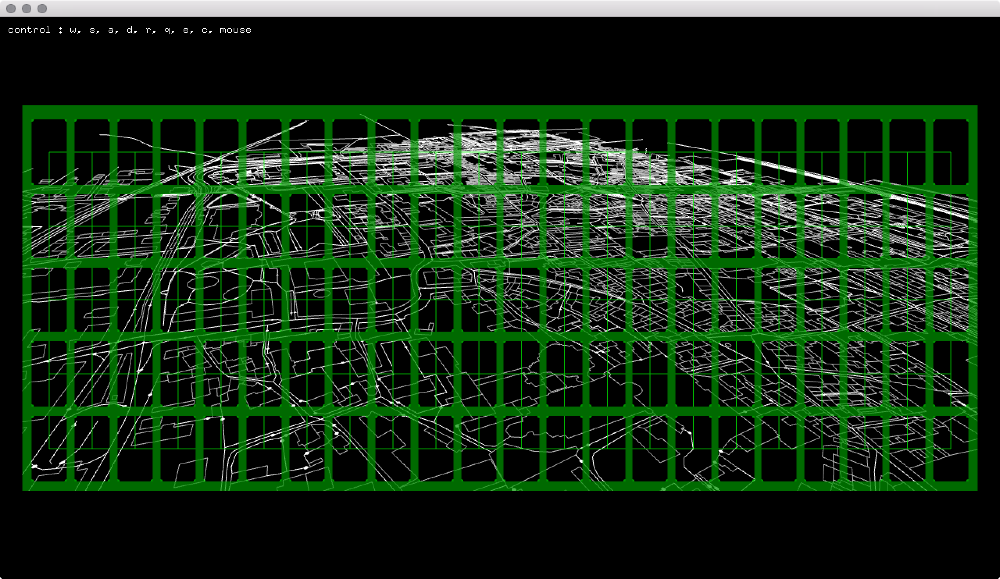

###OSMJsonMapFlying

- Original Code : [https://github.com/tangrams/ofVectorTile](https://github.com/tangrams/ofVectorTile) ( I have changed some codes. )    
my git : [https://github.com/jeonghopark/ofVectorTile](https://github.com/jeonghopark/ofVectorTile)    

     
- ofxFontStash, ofxUnicode, ofxFirstPersonCamera, ofxImmediateodeInput, fxCsv, ofxHui, ofxJSON    

- Map coordinate : [http://www.maptiler.org/google-maps-coordinates-tile-bounds-projection/](http://www.maptiler.org/google-maps-coordinates-tile-bounds-projection/)    
- Map Data : [https://mapzen.com/documentation/vector-tiles/use-service/](https://mapzen.com/documentation/vector-tiles/use-service/)    

    
    

